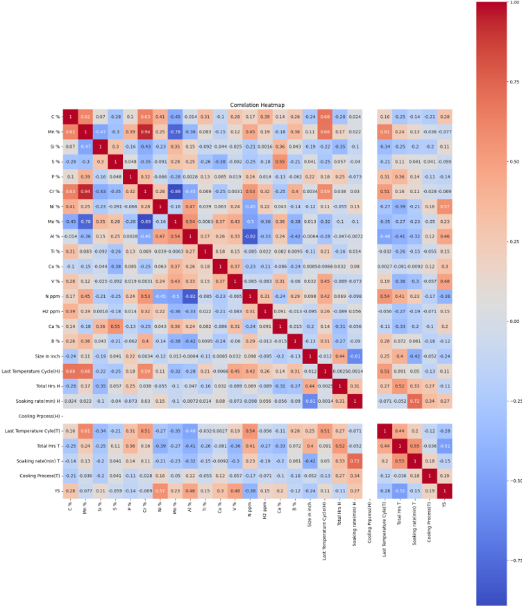
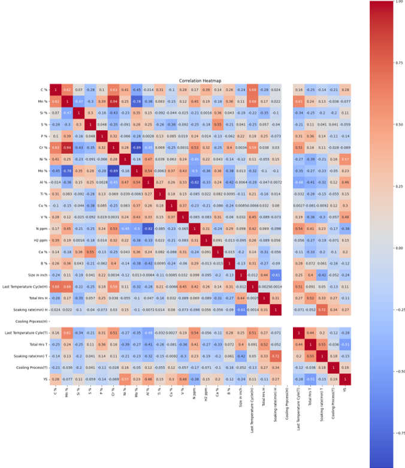
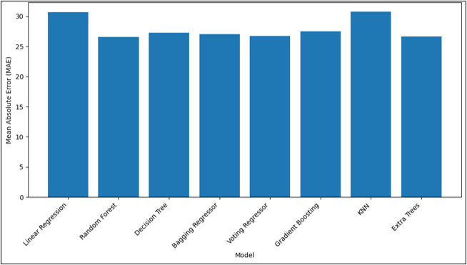
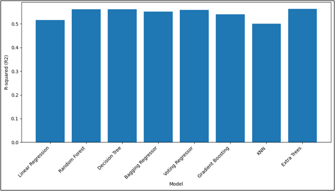

# Predicting Steel Yield Strength from Composition & Heat Treatment

**R&D Intern — Materials Informatics** — [Saarloha Advanced Materials Pvt. Ltd.](https://www.saarloha.com/) (Kalyani Steels), Pune
**May 2024 – Jul 2024**

### Data-driven prediction of steel yield strength using chemical composition and heat-treatment parameters

## Overview

This project focused on developing data-driven models to predict the yield strength of steels using chemical composition, product size, and heat-treatment parameters.

The study used an industrial dataset containing 2,775 steel samples with 25 input variables. The inputs included alloy composition, dimensional information, and hardening and tempering parameters, while yield strength was used as the target property.

The dataset was segmented based on chromium content (Cr < 5% and Cr > 5%) to investigate different steel composition regimes. Multiple regression and machine-learning models were evaluated to identify suitable approaches for yield-strength prediction.

The project also explored the development of an empirical relationship between composition, processing parameters, and yield strength.

> **Data confidentiality:** The industrial dataset used for this project is proprietary and is not included in this repository.

## Methodology

### 1. Dataset
The study utilized an industrial dataset containing **2,775 steel samples**, with **25 input variables** and yield strength as the target property.

The input features represented:

- Chemical composition of the steels
- Product size
- Hardening temperature and soaking conditions
- Tempering temperature and soaking conditions
- Cooling process parameters

The dataset was divided into two composition regimes:

- **Cr > 5%**
- **Cr < 5%**

### 2. Data Preprocessing

The data-preparation workflow included:

- Cleaning missing or incomplete data
- Data transformation and normalization
- Outlier detection using the **Interquartile Range (IQR)** method
- Correlation analysis for feature evaluation
- An **80/20 training–testing split**

### 3. Predictive Modeling

Multiple regression and machine-learning approaches were investigated for yield-strength prediction, including:

- Linear Regression
- Decision Tree Regression
- Random Forest Regression
- Gradient Boosting Regression
- Extra Trees Regression
- Support Vector Regression
- k-Nearest Neighbors (k-NN)
- Voting Regression

Model performance was compared primarily using:

- **Mean Absolute Error (MAE)**
- **Coefficient of Determination (R²)**

---

## Results & Analysis

### Correlation Analysis

#### Cr > 5% Steels


#### Cr < 5% Steels


The correlation analysis was used to examine relationships between alloy chemistry, heat-treatment parameters, and yield strength across the two steel composition regimes.

### Model Performance

#### Mean Absolute Error (MAE)


#### Coefficient of Determination (R²)


Model performance was evaluated using **MAE** and **R²**, enabling comparison of the different regression approaches used for yield-strength prediction.

## Key Results

The model comparison showed that the optimal predictive approach differed between the two steel composition regimes:

- **Cr > 5% steels:** Random Forest Regressor provided the strongest predictive performance.
- **Cr < 5% steels:** Gradient Boosting Regressor provided the strongest predictive performance.
- **Linear Regression** was additionally used to develop an interpretable empirical relationship connecting composition, size, and heat-treatment parameters with yield strength.
- Validation of the empirical relationship on a separate test dataset resulted in an **average reported error of approximately 3%**.

These results demonstrate the potential of combining materials-processing knowledge with data-driven modeling for mechanical-property prediction and process optimization.

---

## Materials Insights

Beyond model prediction, the project used correlation analysis to examine relationships between alloy chemistry, processing conditions, and yield strength.

For the **Cr > 5% steel group**, the analysis indicated:

- A positive correlation between **Ni content and yield strength**
- A positive correlation between **V content and yield strength**
- Relationships between heat-treatment parameters and mechanical properties
- A negative correlation between **sulfur content and yield strength**

This analysis helped connect the machine-learning results with metallurgical understanding of composition–processing–property relationships in steels.

---

## Empirical Formula

Because Linear Regression yields directly interpretable coefficients, it was used to derive a closed-form empirical estimate for YS from the significant features identified in the correlation analysis:

```
YS = 3045.49 + 1026.99·(C%) − 47.57·(Mn%) + 358.40·(Si%) + 484.14·(S%) − 3960.14·(P%)
     + 74.10·(Cr%) − 23.87·(Ni%) + 955.27·(Mo%) + 49.70·(Al%) + 1695.34·(Ti%)
     + 11.66·(Cu%) + 50.84·(V%) − 32.40·(H₂ ppm) + 1.46·(N₂ ppm) − 10974.46·(Ca%)
     − 14987.08·(B%) − 27.11·(Size, in) − 1.53·(Hardening Temp) + 19.26·(Hardening Soak Time)
     − 0.97·(Hardening Soak Rate) − 14.06·(Hardening Cooling) − 2.58·(Tempering Temp)
     + 5.59·(Tempering Soak Time) − 0.12·(Tempering Soak Rate) + 5.59·(Tempering Cooling)
```

Validated against held-out test data, the formula's predictions carried an average error of ~3%.

---

## Skills & Tools

**Materials Engineering**
- Steel metallurgy and alloy design
- Heat-treatment–property relationships
- Composition–processing–property analysis
- Mechanical property prediction

**Data Science & Machine Learning**
- Data preprocessing and outlier detection
- Exploratory data analysis and correlation analysis
- Regression modeling
- Model evaluation using MAE and R²
- Feature–property relationship analysis

**Tools**
- Python
- Pandas
- NumPy
- Scikit-learn
- Matplotlib

---

## Project Significance

Accurate prediction of mechanical properties can support faster materials and process-development decisions while reducing reliance on repeated experimental trials.

This project demonstrates how **materials informatics** can combine industrial steel data, metallurgical knowledge, and machine-learning methods to:

- Predict yield strength from composition and processing parameters
- Compare predictive models across different steel composition regimes
- Identify relationships between alloying elements, heat treatment, and mechanical properties
- Support data-driven process optimization in steel manufacturing

---

## Repository Scope

This repository presents a technical overview of work completed during an industrial internship at **Saarloha Advanced Materials Pvt. Ltd.**

To respect data confidentiality, proprietary industrial datasets, company records, and the complete empirical yield-strength equation are not publicly distributed. The repository is intended to demonstrate the project's methodology, materials-informatics approach, and engineering outcomes.
